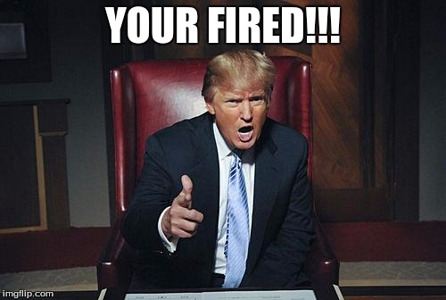

# Intro:

## Definitions:

- `Leadership`: the ability of an individual, group, or organization to "lead", influence, or guide other individuals, teams, or organizations.
- `Leadership Style`: The behavioral approach employed by leaders to influence, motivate, and direct their followers

## Why is it important?

- People don't leave jobs, they leave managers
- Personally, I resigned from 3 jobs due to bad leadership:
  1. After 1 day
  2. After 1 week
  3. After 2.5 months (Just after having one conversation with the leader)

---

- In your life you will be put in leadership positions
  - Man: Career and Family
  - Woman: With her children
- So, as much as you wish that you have a good leader, people under your leadership want you to become a better leader too
- A good leader is more likely to increase the retention (In work or family) and be more effective

---

- If you have to it, then why don't you do it a scientific way?
- Why would you implement your personal views, and your life experience in the team?
- What if your life experience is not enough? or incorrect?

---

- People are hired for their skills, and fired for their attitude.
- And when you are in a managerial position, your attitude and interpersonal skills matter a lot

---

- You will be recognized if you are a good leader in the organization

## A Mix:

- Your leadership style can be a mix of several styles
- You have to know when to use which leadership style

## References:

- https://corporatefinanceinstitute.com/resources/management/leadership-styles/
- https://en.wikipedia.org/wiki/Leadership
